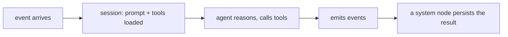

An agent is an LLM worker that reacts to events. When an event reaches its inbox, the platform
loads the agent's prompt and tools; the agent reasons and calls tools; and it emits events. It
never writes entity state directly: it emits, and a system node decides what to persist.



## The agent contract

An agent is declared as a map entry in `agents.yaml`. The key is the agent id and the role
name it fulfills.

```yaml
resolver-agent:
  id: resolver-agent
  role: resolver-agent
  model_tier: sonnet
  permissions_bundle: worker
  manager_fallback: support-coordinator
  subscriptions: [ticket.assigned]
  emit_events: [ticket.resolved, ticket.escalated]
  conversation_mode: session_per_entity
  session_scope: entity
  max_turns_per_task: 10
  entity_writes:
    ticket:
      save: [resolution]
```

| Field | Purpose |
|---|---|
| `model_tier` | Which model the agent runs on (e.g. `haiku`, `sonnet`). |
| `subscriptions` | The events the agent receives. |
| `emit_events` | The events it may emit (each gets an auto-generated `emit_*` tool). |
| `conversation_mode` | `task`, `session`, or `session_per_entity`. |
| `session_scope` | `flow` or `entity`: required for non-`task` modes (`global` is internal-only). |
| `permissions_bundle` | A named permission set from `policy.yaml`; combined with any inline `permissions`. See [Tools](/build/tools). |
| `manager_fallback` | The escalation/hierarchy parent. Omit (or set `null`) for a top-level coordinator, which then resolves to the runtime default. Not a messaging grant. |
| `entity_writes` | Which entity fields the agent's generated `save_*`/`update_*` tools may write. |
| `max_turns_per_task` | Turn budget before the session is terminated. |
| `type` | Optional classification label (defaults to `generic`); used to tag agents, for example by division. Does not change tool or permission gating. |

`conversation_mode` and `session_scope` must form a valid pair (for example,
`session_per_entity` requires `session_scope: entity`); invalid combinations fail at boot.

## What an agent can call

You list only declared tools in `tools`. Beyond those, every agent automatically gets:

- **Universal tools**: `agent_message`, `mailbox_send`.
- **Emit tools**: `emit_{event_name}` for each entry in `emit_events`.
- **Role-scoped entity tools**: `read_*`, `save_*`, `update_*`, generated from the entity
  contract and `entity_writes`.
- **`read_flow_data`**: generated only when a flow-scoped agent declares `flow_data_access`, to
  read deploy-time reference files shipped with the flow.

Host capabilities (`bash`, `web_search`, `file_io`) are gated separately by the
`native_tools` field, a channel independent of `tools` and `permissions`. See
[Tools](/build/tools).

## Prompts

Each agent has a markdown prompt at `prompts/{agent-id}.md`. Prompts use `{{variable}}`
placeholders, substituted at session creation from (in priority order) instance variables,
policy values, entity-state fields, and a small runtime-token allowlist
(`current_date`, `agent_id`, `flow_instance_path`). Substitution is plain string replacement with no logic, and a variable that resolves
nowhere is left as-is.

```markdown
# Resolver

You resolve assigned support tickets using the ticket body and your judgment.

- If confident, save the resolution and emit `ticket.resolved`.
- If the issue needs account access or a human, emit `ticket.escalated` with a reason.

SLA: {{sla_hours}} hours.
```

The platform appends a short environment postamble (the workspace mount paths) to every
prompt. It does not list tools; the model sees those through the tool definitions.

## Keeping reviewers independent

To stop two agents from sharing context, give a role two pools with different subscriptions,
route originals to one and appeals to the other. Same prompt, separate sessions, no shared
context.
