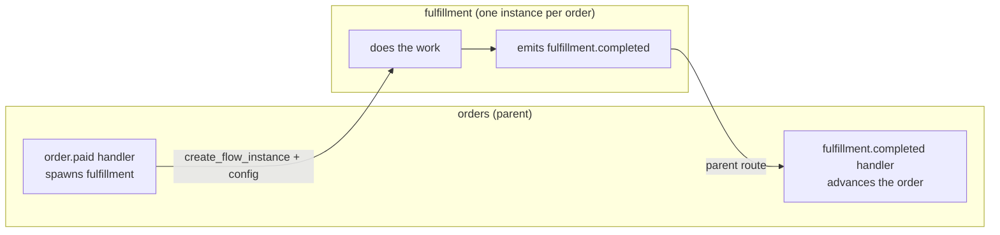

A larger system is built by nesting flows: a parent declares child flows, and the engine walks
the tree into one connected runtime. Flows connect *only* through **pins**, the typed events and
fields at their edges, so a child can be reused or swapped without touching the parent's
internals.

The part that trips people up is not declaring children, it is the **round trip**: getting work
into a child and getting a result back out to the right place. This page works one example
end to end. The parent is an `orders` flow; it has a `notify` child (one instance, wired at
boot) and a `fulfillment` child (one instance per order, created at runtime).



## Why crossing a boundary needs a target

Inside a flow, an event just goes to its subscribers. Across a boundary it is not that simple,
and the reason is multiplicity: **a flow is not a single recipient.** A static flow can hold many
entities at once (one ticket flow, thousands of tickets), and a template flow can have many live
instances (one per order). So "send `fulfillment.completed` to the orders flow" is ambiguous:
*which* order?

Every cross-flow hop therefore has to answer one question, **which entity, in which instance**,
the event is for. `target`, the parent route, and a receiver-side `select_entity` are just
different ways to answer it. That question is the whole reason wiring across flows takes more
than a subscription, and it is worth keeping in mind as you read the rest of this page.

## Declare the children

A parent lists its children in `package.yaml`, each with a mode:

```yaml orders/package.yaml
flows:
  - id: notify
    flow: notify
    mode: static        # exactly one instance, created at boot
  - id: fulfillment
    flow: fulfillment
    mode: template       # zero at boot; one instance per order, created at runtime
```

Each child lives under `flows/{child}/` with its own full package. Which mode to use is the
first design decision:

| | Static child | Template child |
|---|---|---|
| Instances | one, at boot | one per work item, at runtime |
| Reached by | pin wiring (auto-wired at boot) | `create_flow_instance` + a target |
| Use for | a shared service (notifications, audit) | per-order, per-customer work |

## Declare the pins

Pins are a flow's public interface, declared in its `schema.yaml`. An event a flow accepts from
outside is an **input event pin**; an event it sends outward is an **output event pin**. Entity
fields it exposes are **data pins** (`reads` and `writes`). Everything not listed is private.

```yaml notify/schema.yaml
pins:
  inputs:
    events: [order.shipped]      # notify accepts this from the parent
```

```yaml fulfillment/schema.yaml
pins:
  outputs:
    events: [fulfillment.completed]   # fulfillment sends this back out
```

```yaml orders/schema.yaml
pins:
  outputs:
    events: [order.shipped]            # orders emits this to notify
  inputs:
    events: [fulfillment.completed]    # orders accepts the result back
```

A producer's output pin and a consumer's input pin are two halves of one connection: both must
declare the event, or the wire does not exist.

## Pattern 1: a static child, wired at boot

For static children, the engine **auto-wires** at boot: it matches each output event pin to the
input pin that accepts it. Once `orders` emits `order.shipped` (a declared output pin), it lands
in `notify` with no target and no extra code:

```yaml orders/nodes.yaml
order.delivered:
  advances_to: closed
  emit:
    event: order.shipped              # an output pin -> auto-wired to notify
    fields:
      order_id: entity.order_id
```

The one rule to know: if a single input pin could match outputs from **more than one** flow, boot
fails as ambiguous, and you disambiguate with an explicit `target` (below) or a scoped
subscription. Auto-wiring only works when the match is unique.

## Pattern 2: spawn a template instance

A template child does not exist until you create one. A handler mints an instance with the
`create_flow_instance` action, passing data in through `config_from` (there is no shared memory
between flows; data crosses through the payload or config, never through direct entity reads):

```yaml orders/nodes.yaml
order.paid:
  action: create_flow_instance
  template: fulfillment
  instance_id_from: payload.order_id       # the new instance's id
  config_from:
    order_id: payload.order_id             # values the child reads as config
    address: payload.ship_to
  advances_to: fulfilling
```

The platform validates the template, builds the instance path, registers its nodes and agents,
records a **parent route** back to this flow, creates the child's entity at its `initial_state`,
and starts it. A child can declare `auto_emit_on_create` in its schema to fire its first event
from that config.

**Addressing an existing instance.** To send an event to a specific instance you already have,
target it by id; to pick one by an entity field, match on it:

```yaml
emit:
  event: fulfillment.expedite
  target: { instance_id: payload.order_id }   # this exact instance
# or
  target: { flow: fulfillment, match: { order_id: payload.order_id } }  # the one whose order_id matches
```

## The return path

This is the hard half. The child has its own state and its own entity; when it finishes, it
sends a result back as an **output pin** event:

```yaml fulfillment/nodes.yaml
fulfillment.packed:
  advances_to: done
  emit:
    event: fulfillment.completed      # an output pin
    fields:
      order_id: entity.order_id       # carry the key the parent needs
      tracking: entity.tracking
```

Because the instance was created with a parent route, that output pin returns to the parent
automatically, no target needed. (Inside an event chain you can also reply to whoever called you
with `target: sender`.)

The parent receives it on a handler, and here is the key move: the parent must **re-attach to
the right order**, because the event arrived at the `orders` flow, which holds many orders, not
at a specific one. It does that with `select_entity`, using the key the child carried in the
payload:

```yaml orders/nodes.yaml
fulfillment.completed:
  select_entity:
    by:
      order_id: payload.order_id      # find the order this result belongs to
  data_accumulation:
    writes: [tracking]
    source_event: fulfillment.completed
  advances_to: shipped
```

So the full loop is: parent spawns the child with `create_flow_instance` and `config_from`; the
child works in its own state machine; the child emits an output pin carrying the business key;
the parent route delivers it back; the parent re-selects its entity by that key and continues.

## Ownership rules to keep straight

- **Each flow owns its own entity.** A receiving handler must say how it acquires one:
  `create_entity`, `select_entity`, or `select_or_create_entity`. State is flow-local; nothing
  reads another flow's entity directly.
- **Data crosses only through payloads and `config_from`.** Cross-flow entity reads are
  prohibited; carry what the other side needs in the event.
- **One writer per data pin.** Two flows may not both write the same entity field (a boot error).

## Addressing reference

When you name an event or flow, it resolves by whether it contains a slash:

- **Local**: `order.paid`, an event in the current flow.
- **Absolute**: `intake/ticket.ready`, navigated from the root.
- **Wildcard**: `fulfillment/*/fulfillment.completed` matches any direct instance; `**` matches
  any depth. Wildcards expand to include new dynamic instances as they are created, which is how
  a parent subscribes to results from instances that did not exist at boot.

## Policy inheritance

Child flows inherit parent and root policy and override specific keys. See
[Policy](/build/policy).

<CardGroup cols={2}>
  <Card title="Events and routing" icon="bolt" href="/concepts/events-and-routing">
    The full routing model: targets, the parent route, wildcards, and the event envelope.
  </Card>
  <Card title="Flows and entities" icon="diagram-project" href="/concepts/flows-and-entities">
    Flows, instances, entities, and pins as a public interface.
  </Card>
</CardGroup>
