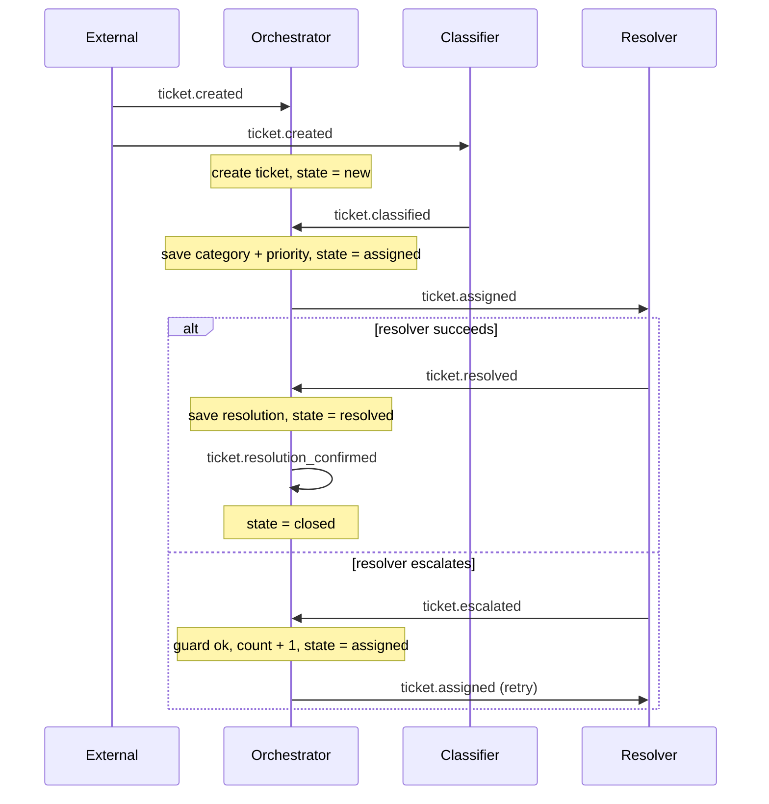

This guide builds a small but complete flow from an empty directory. By the end you will have
a contract bundle that passes the static analyzer and boots, and, more importantly, you will
understand what each file does and why.

You will build a **support-ticket system**: a ticket arrives, an agent classifies it, a
deterministic orchestrator routes it to a resolver agent, and it closes. If the resolver
cannot solve it, the ticket loops back and tries again until it hits a limit.

<Tip>
  That is more declaration than you would write to script an LLM directly. If you are already
  wondering whether it is worth it, jump to
  [What the contracts buy you](#what-the-contracts-buy-you), then come back.
</Tip>

## The mental model

Before the files, three ideas. Everything in Swarm is built from them:

1. **Events are messages.** Nothing happens except in response to an event. `ticket.created`,
   `ticket.classified`, and so on are events, each carrying a typed payload.
2. **A system node is deterministic code.** No LLM. It subscribes to events and, for each one,
   runs a fixed pipeline: check a condition, write some data, advance the state, emit the next
   event. Same input, same result, every time.
3. **Agents are LLM workers.** They subscribe to events, reason, and emit events. An agent
   never changes state directly; it emits an event with its result, and a system node decides
   what to write. That is what keeps the system auditable.

Here is the whole flow as events moving between the orchestrator (deterministic) and the two
agents (LLM):



## The files you will write

A flow is a directory of small YAML files, each with one job:

| File | Its job in this flow |
|---|---|
| `package.yaml` | Names the flow and the platform version it targets. |
| `schema.yaml` | The ticket's lifecycle (states), the event it accepts, and the agent roles it needs. |
| `entities.yaml` | The ticket's data fields. |
| `events.yaml` | The payload shape of each event. |
| `nodes.yaml` | The orchestrator and its handlers (the deterministic logic). |
| `agents.yaml` | The classifier and resolver agents. |
| `policy.yaml` | Configuration values, like the escalation limit. |
| `prompts/` | One instruction file per agent. |

Create them one at a time.

<Note>
  Every contract below passes `swarm verify`. The bundle uses only built-in scalar types and a
  single self-contained flow, so there is nothing else to set up.
</Note>

<Steps>
  <Step title="Name the flow (package.yaml)">
    Every flow starts with a manifest. It names the flow and declares which Swarm versions it
    runs on.

    ```yaml package.yaml
    name: ticket-flow                 # the flow's name
    version: 1.0.0                    # this flow package's own version
    description: Support ticket classification and resolution.
    platform_version: ">=1.6.0"       # Swarm versions this bundle is compatible with
    flows: []                         # child flows go here; we have none
    ```

    `flows` is where larger systems list child flows; ours is a single flow, so it is empty.
    See [the flow package](/build/flow-package) for the complete file list.
  </Step>

  <Step title="Declare the lifecycle (schema.yaml)">
    `schema.yaml` is the flow's public surface. It declares three things: the **states** a
    ticket moves through, the **pins** (which events the flow accepts from outside), and the
    **agent roles** the flow needs.

    ```yaml schema.yaml
    initial_state: new                # where a new ticket starts
    terminal_states: [closed]         # once closed, no more events are accepted
    states: [new, assigned, resolved, closed]   # every state the ticket can be in

    pins:
      inputs:
        events: [ticket.created]      # the only event this flow accepts from outside

    required_agents:                  # the roles this flow needs filled
      - role: classifier-agent
        subscribes_to: [ticket.created]
        emits: [ticket.classified]
      - role: resolver-agent
        subscribes_to: [ticket.assigned]
        emits: [ticket.resolved, ticket.escalated]
    ```

    **States.** A ticket is always in exactly one state. List every state in `states`. The
    analyzer rejects a state that nothing ever advances to, so the list is exactly the four the
    flow uses.

    **Pins** are the flow's public interface. An input event pin is the front door:
    `ticket.created` is the only event the outside world can send in.

    **Required agents** are the roles the flow depends on. Each says what it listens to and
    what it emits; we will provide matching agents in `agents.yaml`. Boot fails if a declared
    role has no matching agent. See [the state machine reference](/build/state-machine).
  </Step>

  <Step title="Declare the data (entities.yaml)">
    An **entity** is the thing moving through the state machine, here a single ticket. It is a
    record with typed fields plus its current state. Declare the fields handlers will fill in.

    ```yaml entities.yaml
    ticket:
      category: text                  # set by the classifier
      priority: text                  # set by the classifier
      resolution: text                # set by the resolver
      resolved_by: text               # set by the resolver
      escalation_count:               # how many times it has bounced back
        type: integer
        initial: 0                    # starts at 0
    ```

    Most fields use the short form `name: type`. `escalation_count` uses the longer form
    because it needs an `initial` value: every declared field must have an `initial` or a
    handler that writes it, or the analyzer reports it as uncovered. You do **not** declare the
    ticket's state here; the platform tracks `current_state` from the state machine for you.
  </Step>

  <Step title="Declare the events (events.yaml)">
    Events are how every part of the flow talks to every other part. Each event declares the
    fields its payload carries. Routing is **not** declared here; it comes entirely from who
    subscribes to what (the next two files).

    ```yaml events.yaml
    ticket.created:
      swarm:
        source: external              # produced outside the flow (an API call, a webhook)
      ticket_id: text
      subject: text
      body: text
    ticket.classified:
      ticket_id: text
      category: text
      priority: text
    ticket.assigned:
      ticket_id: text
      category: text
      priority: text
    ticket.resolved:
      ticket_id: text
      resolution: text
      resolved_by: text
    ticket.escalated:
      ticket_id: text
      reason: text
    ticket.resolution_confirmed:
      ticket_id: text
    ```

    Fields go directly under the event name (there is no `payload:` wrapper). `swarm.source:
    external` tells the analyzer that `ticket.created` comes from outside, so it does not
    expect something inside the flow to produce it. Whatever emits an event must fill **every**
    field it declares; there are no defaults. See [Events and routing](/concepts/events-and-routing).
  </Step>

  <Step title="Write the orchestrator (nodes.yaml)">
    This is the engine room. A **system node** is deterministic code that subscribes to events
    and runs one **handler** per event. A handler runs a fixed pipeline and commits it in a
    single transaction: optionally **guard** (check a condition), **write** fields, **advance**
    the state, and **emit** the next event.

    ```yaml nodes.yaml
    ticket-orchestrator:
      id: ticket-orchestrator
      execution_type: system_node     # deterministic, no LLM
      produces:                        # the events this node emits
        - ticket.assigned
        - ticket.resolution_confirmed
      subscribes_to:                   # the events this node handles
        - ticket.created
        - ticket.classified
        - ticket.escalated
        - ticket.resolved
        - ticket.resolution_confirmed
      event_handlers:

        ticket.created:                # a brand-new ticket arrives
          create_entity: true          # mint the ticket record
          advances_to: new             # set its state to "new"

        ticket.classified:             # the classifier has labeled it
          data_accumulation:           # copy fields from the event onto the ticket
            writes:
              - source_field: category     # payload.category ->
                target_field: category      #   entity.category
              - source_field: priority
                target_field: priority
            source_event: ticket.classified
          advances_to: assigned
          emit: ticket.assigned        # hand off to the resolver

        ticket.escalated:              # the resolver gave up
          guard:
            id: escalation_limit
            check: "entity.escalation_count < policy.max_escalations"
            on_fail: reject            # too many tries: stop here
          data_accumulation:
            writes:
              - target_field: escalation_count
                expression: "entity.escalation_count + 1"   # count this attempt
          advances_to: assigned        # send it back to the resolver
          emit: ticket.assigned

        ticket.resolved:               # the resolver succeeded
          data_accumulation:
            writes: [resolution, resolved_by]   # short form: same name on payload and entity
            source_event: ticket.resolved
          advances_to: resolved
          emit: ticket.resolution_confirmed

        ticket.resolution_confirmed:   # finish up
          advances_to: closed          # terminal
    ```

    Read it handler by handler:

    - **`ticket.created`** is the entry point. A stateful flow's input-pin handler must say how
      it gets its entity; `create_entity: true` mints a fresh ticket. It then advances to `new`.
    - **`ticket.classified`** copies `category` and `priority` from the event onto the ticket
      (`data_accumulation`), advances to `assigned`, and emits `ticket.assigned` for the
      resolver. The `source_field`/`target_field` form copies a payload field to an entity
      field.
    - **`ticket.escalated`** runs a **guard** first: `entity.escalation_count <
      policy.max_escalations`. If the ticket has bounced too many times the guard fails and
      `on_fail: reject` stops it; otherwise it increments the counter (a computed write,
      `expression`) and routes back to `assigned` to try again.
    - **`ticket.resolved`** saves the resolution and emits `ticket.resolution_confirmed`. Here
      the short `writes: [resolution, resolved_by]` form copies same-named payload fields.
    - **`ticket.resolution_confirmed`** advances to `closed`, a terminal state.

    Exactly one system node may handle a given event, which keeps state changes unambiguous.
    `produces` is the list of events this node emits; the analyzer checks it matches the
    handlers. For every field a handler can use, see the [handler reference](/reference/handler-fields).
  </Step>

  <Step title="Add the agents (agents.yaml)">
    Agents are the LLM workers. Each subscribes to events, reasons, and emits events. Note what
    they do **not** do: they never write the ticket's fields directly. The resolver puts its
    answer in the `ticket.resolved` payload, and the orchestrator's handler writes it. Agents
    emit; system nodes decide what to persist.

    ```yaml agents.yaml
    classifier-agent:
      id: classifier-agent
      role: classifier-agent          # matches the role in schema.yaml
      model_tier: haiku               # a small, fast model is enough to classify
      subscriptions: [ticket.created] # the events it receives
      emit_events: [ticket.classified]  # the events it may emit
      conversation_mode: task         # a fresh session per event, no memory
      max_turns_per_task: 3

    resolver-agent:
      id: resolver-agent
      role: resolver-agent
      model_tier: sonnet              # a stronger model to draft resolutions
      subscriptions: [ticket.assigned]
      emit_events: [ticket.resolved, ticket.escalated]
      conversation_mode: task
      max_turns_per_task: 10
    ```

    Each agent's `emit_events` automatically gives it a tool to emit those events (for example
    `emit_ticket_classified`). `task` mode means a fresh session per event with no memory
    between tickets.

    <Note>
      To give the resolver one persistent session per ticket
      (`conversation_mode: session_per_entity`, `session_scope: entity`), the agent must live
      in a child flow, not the root. Entity and flow session scope require a flow-scoped agent.
      See [Composing flows](/build/composition).
    </Note>
  </Step>

  <Step title="Set policy (policy.yaml)">
    Policy holds configuration values. Guards read them as `policy.X`, and prompts use them as
    `{{X}}`. The escalation guard above read `policy.max_escalations`.

    ```yaml policy.yaml
    sla_hours: 24
    max_escalations: 3                # the guard stops a ticket after 3 escalations
    ```
  </Step>

  <Step title="Write the prompts (prompts/)">
    Each agent gets a markdown prompt that tells it what to do and what to emit. `{{variable}}`
    placeholders are filled from policy and instance values at run time.

    ```markdown prompts/classifier-agent.md
    # Classifier

    You classify support tickets by category and priority.

    Read the ticket subject and body, then emit `ticket.classified` with:
    - category: one of billing, technical, account, feature
    - priority: one of critical, high, medium, low
    ```

    ```markdown prompts/resolver-agent.md
    # Resolver

    You resolve assigned tickets.

    Draft a resolution from the ticket body. If you are confident, emit `ticket.resolved` with
    the resolution and your id. If the issue needs account access or a human, emit
    `ticket.escalated` with a reason.
    ```
  </Step>

  <Step title="Verify">
    ```bash
    swarm verify --contracts ./ticket-flow
    ```

    Expect `verify ok`. The analyzer checks payload coverage, state reachability, agent
    fulfillment, entity writer coverage, handler fields, and CEL parsing, among others. (It may
    also print informational `lint_evidence` notes, such as a field with no internal reader;
    those are not errors.) If it reports an error, the
    [analyzer-checks reference](/reference/analyzer-checks) explains each one and how to fix it.
  </Step>
</Steps>

## How the pieces connect

Trace one ticket through the diagram at the top:

1. `ticket.created` arrives from outside. The orchestrator mints the ticket and advances it to
   `new`; the classifier (subscribed to the same event) reads it and emits `ticket.classified`.
2. The orchestrator handles `ticket.classified`: it saves `category` and `priority`, advances
   to `assigned`, and emits `ticket.assigned`.
3. The resolver handles `ticket.assigned` and emits either `ticket.resolved` (the orchestrator
   saves the resolution, advances to `resolved`, and emits `ticket.resolution_confirmed`, which
   closes the ticket) or `ticket.escalated` (the guard checks the count, increments it, and
   sends the ticket back to `assigned`).

Notice the division of labor throughout: agents decide *what* (classify, resolve, escalate);
the orchestrator decides *what gets written and what happens next*. Every declared state is
reachable, and every event has either a handler or a subscriber.

## What the contracts buy you

A single LLM with a script is fine for one task. The trouble starts when you make the model
*be* the system: tracking state, following rules exactly, and staying coherent across a long,
multi-step job with many agents. LLMs are not good at that. They drift, they lose the plot as
context fills, and an agent will happily report "the ticket is resolved" when it is not.
Swarm's answer is to let LLMs do the judgment in small, targeted bursts and leave the rigid
parts (state, rules, routing) to deterministic system nodes. Here is what that buys, with the
flow you just wrote as the small example:

- **Reliability: the model cannot fake the outcome.** An agent can *say* it resolved the
  ticket, but saying so does not make it so. Agents only emit events; a deterministic system
  node decides what is written and whether the ticket advances. It reaches `resolved` because
  a handler advanced it after `ticket.resolved` arrived, never because the model asserted it.
  Rules like the escalation cap are checks the platform runs every time, not instructions you
  hope the model remembers. And because each transition commits atomically, the ticket is
  always in exactly one declared state, never half-updated.
- **Compose many agents, for as long as it takes.** Each agent is a small unit wired to the
  others only through typed events and pins, never one shared mega-prompt. You grow a system
  by adding roles and whole sub-flows (coordinator, managers, workers), not by enlarging a
  central script. This flow has two agents; the same model coordinates hundreds, and a run can
  span hours or days, surviving restarts along the way.
- **No context explosion, and sharper agents.** A single agent, or a flat "everyone in one
  chat", drowns as the work grows: the context window fills and quality drops. Each Swarm
  agent runs in a scoped session that sees only its own events, so the classifier never
  carries the resolver's history. Splitting work into small, focused tasks is not just how you
  scale; it is what makes each individual LLM call more reliable.

And, almost for free, the things you would otherwise hand-build:

- **The wiring is checked before it runs.** `swarm verify` caught the bugs a script hides
  until production: a state nothing reaches, a missing payload field, an unfilled role, a
  dangling event.
- **Every run is auditable and replayable.** The event log, the before/after of every field,
  and each agent's turn are recorded and tied to the run, so "why did it do that?" is a query.
  You can replay a run or fork it against fixed contracts.
- **A human step is one line away** (`mailbox_write`): the decision becomes just another
  event, with no queue or resume code to build.

### When a script is the better call

Be honest about the fit. For a single LLM call, a short conversation, or a workflow you will
rewrite next week, a plain script is the right tool and Swarm is overkill. The contracts pay
off when many agents must coordinate, the work is long-running, the state has to stay
consistent, or it runs at volume. See [Why Swarm](/why-swarm) for the full picture.

## Run it

With Postgres running (see [Installation](/installation)), run the bundle from the repository
root. `swarm run` boots a runtime in process, publishes the trigger, and streams the trace:

```bash
export SWARM_API_TOKEN=dev-token        # any value; required by every command but `swarm verify`

echo '{"ticket_id": "t-1", "subject": "Double charge", "body": "I was billed twice."}' > ticket.json
swarm run --contracts ./ticket-flow --event ticket.created --payload ticket.json
```

The trace shows the ticket created, advanced to `new`, and `ticket.created` delivered to the
classifier agent.

<Note>
  Unlike the deterministic flow in the [Quickstart](/quickstart), this flow has LLM agents, so
  it advances past `new` only when a runtime that can answer them is configured: a real
  provider (`SWARM_LLM_RUNTIME_MODE: api` with a credential) or scripted agent fixtures for
  token-free runs (see [Testing](/build/testing)). The deterministic system-node steps run
  either way.
</Note>

## What to read next

<CardGroup cols={2}>
  <Card title="Core concepts" icon="book" href="/concepts/overview">
    The model behind flows, events, handlers, and agents.
  </Card>
  <Card title="Writing handlers" icon="gears" href="/build/handlers">
    Guards, branching, accumulation, and actions in depth.
  </Card>
  <Card title="Handler patterns" icon="shapes" href="/patterns/overview">
    Reusable shapes for common orchestration problems.
  </Card>
  <Card title="Testing" icon="vial" href="/build/testing">
    The analyzer, test packages, and agent fixtures.
  </Card>
</CardGroup>
