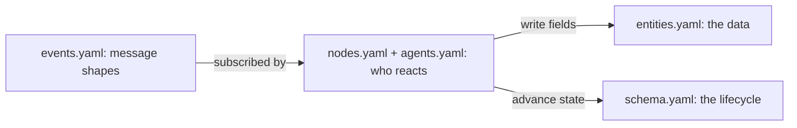

A flow is a directory of YAML contracts plus agent prompts. The engine reads the package and
executes it, no product-specific code.

The files are not independent; they describe one running system from different angles. Events
are the messages, the nodes and agents say who reacts to them, and the entity and schema say
what data and states result:



## Directory layout

```text
my-flow/
  package.yaml      # identity, version, platform constraint, child flows
  schema.yaml       # state machine, pins, required agents
  entities.yaml     # the entity contract (typed persistent fields)
  types.yaml        # shared named types, enums, lists (optional)
  nodes.yaml        # system nodes and their handlers
  events.yaml       # event payload schemas
  agents.yaml       # agent definitions
  tools.yaml        # tool definitions (optional)
  policy.yaml       # configuration values (optional)
  prompts/          # agent behavioral instructions (one .md per agent)
  data/             # immutable reference data, read via read_flow_data (optional)
  flows/            # child flows (optional)
```

## What each file does

| File | Responsibility |
|---|---|
| `package.yaml` | Flow identity: `name`, `version`, `platform_version`, and child `flows`. |
| [`schema.yaml`](/build/state-machine) | States, pins, and `required_agents`: the flow's public surface. |
| [`entities.yaml`](/reference/contracts/entities) | The typed persistent fields of the entity this flow owns. |
| `types.yaml` | Shared named types, enums, and lists used by entities and events. |
| [`nodes.yaml`](/build/handlers) | System nodes and their event handlers. |
| `events.yaml` | The payload schema for each event. |
| [`agents.yaml`](/build/agents-and-prompts) | Agent roles: subscriptions, emitted events, tools, model tier. |
| [`tools.yaml`](/build/tools) | Tool definitions agents can call. |
| [`policy.yaml`](/build/policy) | Configuration values referenced through `policy.*`. |
| `prompts/` | One markdown prompt per agent. |

## Minimum package

Only `package.yaml` and `schema.yaml` are strictly required. The rest follow the work: no
agents means no `prompts/`, no handlers means no `nodes.yaml`, no events means no
`events.yaml`. A flow must also have either an `agents.yaml` or at least one child flow.

<Card title="Build your first flow" icon="rocket" href="/build/first-flow">
  A complete support-ticket flow, file by file.
</Card>
