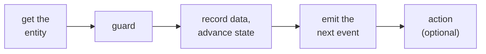

A handler is what a system node runs when a matching event arrives. You declare it as YAML, and
the engine runs its steps in a fixed order (not the order you write them) and commits them all
in one transaction, so a crash never leaves a half-applied change. The common path:



This page walks those steps in the order you write them. For the conceptual model see
[System nodes and handlers](/concepts/system-nodes-and-handlers); for the exhaustive field list
and the precedence rules, see [Handler fields](/reference/handler-fields) and the
[execution model](/reference/execution-model).

## A handler, annotated

```yaml
ticket.classified:
  guard:                                   # 1. only continue if the category is valid
    id: valid_category
    check: "payload.category in ['billing', 'technical', 'account']"
    on_fail: reject
  data_accumulation:                       # 2. record fields from the event onto the ticket
    writes:
      - source_field: category
        target_field: category
      - source_field: priority
        target_field: priority
    source_event: ticket.classified
  advances_to: assigned                    # 3. advance the state
  emit:                                    # 4. emit the next event, with its payload
    event: ticket.assigned
    fields:
      category: entity.category
      priority: entity.priority
```

## How data moves between steps

Three places hold data, and each is reached a different way. Knowing which is which prevents the
most common authoring mistake:

- **The entity** is the durable store. Write to it with `data_accumulation`; read it anywhere
  with `entity.*`. Entity fields persist across handlers, so a value written when the ticket was
  created is still readable when a later event arrives.
- **The emitted payload** is how a handler hands data to the next subscriber. You build it with
  `emit.fields`. It is neither the entity nor the triggering event: you populate it explicitly.
- **An agent sees only the payload of the event delivered to it**, never the entity directly. So
  that payload is the contract for what the agent can act on. If a resolver agent needs the
  ticket body, the event that reaches it must carry the body.

So a value flows like this: an event arrives, `data_accumulation` records what matters on the
entity, and `emit.fields` reads from the entity to populate the next event. Guards and
`data_accumulation` expressions read `entity.*` as it stood before this handler's writes; the
emit step runs after the writes, so it sees them.

## Getting the entity

Every handler runs against one entity, the record moving through the flow (here, a ticket). Most
handlers inherit it from the event that triggered them and need to do nothing. But the handler
that receives a flow's **first** event has no entity yet, so it must say where one comes from.
Declare exactly one of these:

- **`create_entity: true`** mints a new entity at the flow's initial state. Use it when the event
  starts a new item in this flow (a fresh ticket arriving). The new entity gets a new id, and
  every declared field is set to its initial value, so a guard in the same handler can already
  read them.
- **`select_entity`** attaches to one existing entity, matched by a business key:

  ```yaml
  select_entity:
    by:
      order_id: payload.order_id      # match an entity field to a value from the payload
  ```

  Exactly one entity must match; zero or several is an error (the handler fails closed rather
  than guessing).
- **`select_or_create_entity`** matches an existing entity, or mints one from the key if none
  matches.

Leaving all three off a handler that receives an outside event is a boot error: it would run
against the event's sender instead of your entity. For the state-machine side of this, see
[The state machine](/build/state-machine).

## Guarding a transition

A guard blocks the handler unless its [CEL](/reference/expressions-cel) check passes. The check
reads `entity`, `payload`, and `policy`; supply a list of checks under `checks` if you need more
than one (all must pass). `on_fail` chooses what happens when a check fails:

| `on_fail` | Behavior |
|---|---|
| `reject` (default) | Stop. Event marked rejected. |
| `discard` | Drop silently: for expected filtering. |
| `kill` | Advance the entity to a terminal state. |
| `escalate:{event}` | Emit an escalation event instead of proceeding. |

A guard reads the entity *before* this handler's own writes, so it reflects what earlier
handlers left, not what this one is about to change.

## Recording data on the entity

`data_accumulation` writes fields onto the entity. `writes` is a list, and each item takes one of
four forms:

```yaml
data_accumulation:
  writes:
    - category                              # direct:   payload.category -> entity.category
    - source_field: pri                     # mapped:   payload.pri -> entity.priority
      target_field: priority
    - target_field: source                  # literal:  a constant value
      value: "support"
    - target_field: attempts                # computed: a CEL expression
      expression: "entity.attempts + 1"
  source_event: ticket.classified           # defaults to the triggering event
```

`value` and `expression` are mutually exclusive on one item, and the literal key is `value`, not
`literal`. What you write here is readable as `entity.*` in later handlers, not just this one.

## Advancing state and setting gates

- **`advances_to`** moves the entity to another state. The target must be one of the flow's
  declared states, and `advances_to` is the only thing that changes an entity's state.

  ```yaml
  ticket.resolution_confirmed:
    advances_to: closed       # a terminal state
  ```

- **`sets_gate`** raises a named flag (a *gate*) on the entity, for example `sets_gate: approved`.
  A gate is a boolean a later guard can check (`check: "entity.gates.approved"`). Declare the gate
  in the node's `gate_state`. To reset, `clear_gates: true` clears **every** gate on the entity,
  not just this node's.

See [Gates, timers, and state](/concepts/gates-timers-and-state) for the model behind states and
gates.

## Emitting the next event

An emitted event's payload is **producer-complete**: the handler must populate every field the
event declares, through `emit.fields`. Nothing is copied automatically from the triggering
event, and there are no defaults. Each entry in `fields` is a CEL expression, usually reading
the entity you just wrote or the incoming `payload`:

```yaml
emit:
  event: ticket.assigned        # declares fields: category, priority
  fields:
    category: entity.category   # read the fields this handler just wrote
    priority: entity.priority
```

The bare string form, `emit: ticket.assigned`, emits with an **empty** payload. The analyzer
accepts it, so the empty payload only shows up at runtime when a subscriber receives `{}`. Use
the bare form only for events that declare no fields; reach for `fields` the moment an event
carries data.

**Targeting is a separate, routing-only concern.** Routing inside a flow comes from
subscriptions, so an internal emit needs no target. A pin-declared output that crosses a flow
boundary must resolve a recipient with `target` (`sender`, `{instance_id}`, `{flow, match}`) or
opt out with `broadcast: true`:

```yaml
emit:
  event: ticket.resolved
  fields:
    resolved_by: entity.resolved_by
  broadcast: true
```

## Branching

A handler branches with `on_complete` or `rules`, never both.

`on_complete` is an ordered list; the first matching condition wins. Use it after accumulation or
computation:

```yaml
on_complete:
  - condition: "entity.score >= policy.threshold"
    advances_to: approved
    emit: candidate.approved
  - condition: "entity.score < policy.threshold"
    advances_to: rejected
    emit: candidate.rejected
```

`rules` is a list of named branches matched against the payload; each can carry its own writes,
transition, and emit:

```yaml
rules:
  - id: billing
    condition: "payload.category == 'billing'"
    advances_to: billing_review
    emit:
      event: billing.requested
      broadcast: true
  - id: technical
    condition: "payload.category == 'technical'"
    advances_to: tech_review
    emit:
      event: tech.requested
      broadcast: true
```

When `rules` is present, the matched rule owns the emit; a handler-level `emit` alongside `rules`
fails at boot. A handler top-level `emit` is valid only when the handler has a single emit site,
so it also conflicts with `on_complete`, `accumulate.on_timeout`, or `fan_out` emit.

## Growing a handler

As a flow gets more capable, handlers gain a few more tools. They are introduced here and covered
in depth elsewhere:

- **Wait for several events before acting** with `accumulate` (completion conditions,
  deduplication, and copying the gathered items to a typed entity field). This has a footgun or
  two; see [Accumulation and projection](/reference/accumulation).
- **Compute over collected data** with `compute`, `filter`, `reduce`, and `count`. See
  [Handler fields](/reference/handler-fields).
- **Run a platform action** with `action`. The common one is `mailbox_write`, which puts a
  decision in a human's mailbox and lets the flow wait for the answer:

  ```yaml
  action:
    id: mailbox_write
    mailbox:
      item_type: refund_approval
      severity: urgent
      summary: "Refund over the policy limit needs a manager"
      payload:
        amount: entity.amount
  ```

  The others are `create_flow_instance` (spin up a child flow), `record_evidence` (append to an
  audit accumulator), and `artifact_repo_commit` (commit files to a git repo). See
  [Handler fields](/reference/handler-fields).

<CardGroup cols={2}>
  <Card title="Handler patterns" icon="shapes" href="/patterns/overview">
    Guard-and-escalate, fan-out, accumulate-and-compute, and more.
  </Card>
  <Card title="Handler execution model" icon="diagram-project" href="/reference/execution-model">
    The full step order, atomicity, and what takes precedence over what.
  </Card>
</CardGroup>
