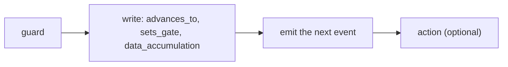

A handler is the recipe a system node runs when a matching event arrives. Its fields do not
run in the order you write them; they run in a fixed pipeline and commit together in one
transaction, so a crash never leaves a half-applied change.

The common path through that pipeline:



A guard can stop the handler; otherwise it writes to the entity, emits the next event, and
optionally runs a platform action. The full pipeline adds accumulation, computation, and
list-processing steps before the writes; see the
[handler reference](/reference/handler-fields). For the conceptual model see
[System nodes and handlers](/concepts/system-nodes-and-handlers).

## A handler, annotated

```yaml
ticket.classified:
  guard:                                   # 1. gate the handler
    id: valid_category
    check: "payload.category in ['billing', 'technical', 'account']"
    on_fail: reject
  data_accumulation:                       # 2. write fields from the payload
    writes:
      - source_field: category
        target_field: category
      - source_field: priority
        target_field: priority
    source_event: ticket.classified
  advances_to: assigned                    # 3. advance the state
  emit: ticket.assigned                    # 4. emit the follow-up event
```

## Guards

A guard blocks the handler unless its CEL check passes. `on_fail` chooses what happens when
it fails:

| `on_fail` | Behavior |
|---|---|
| `reject` (default) | Stop. Event marked rejected. |
| `discard` | Drop silently: for expected filtering. |
| `kill` | Advance the entity to a terminal state. |
| `escalate:{event}` | Emit an escalation event instead of proceeding. |

## Branching

A handler branches with `on_complete` or `rules`, never both.

`on_complete` is an ordered list; the first matching condition wins. Use it after
accumulation or computation:

```yaml
on_complete:
  - condition: "entity.score >= policy.threshold"
    advances_to: approved
    emit: candidate.approved
  - condition: "entity.score < policy.threshold"
    advances_to: rejected
    emit: candidate.rejected
```

`rules` is a list of named branches matched against the payload; each can carry its own
writes, transition, and emit:

```yaml
rules:
  - id: billing
    condition: "payload.category == 'billing'"
    advances_to: billing_review
    emit:
      event: billing.requested
      broadcast: true
  - id: technical
    condition: "payload.category == 'technical'"
    advances_to: tech_review
    emit:
      event: tech.requested
      broadcast: true
```

When `rules` is present, the matched rule owns the emit; a handler-level `emit` alongside
`rules` fails at boot.

## Writing fields with data_accumulation

`writes` is a list, and each item takes one of four forms:

```yaml
data_accumulation:
  writes:
    - category                              # direct: payload.category -> entity.category
    - source_field: pri                     # mapped:  payload.pri -> entity.priority
      target_field: priority
    - target_field: source                  # literal: a constant value
      value: "support"
    - target_field: attempts                # computed: a CEL expression
      expression: "entity.attempts + 1"
  source_event: ticket.classified
```

`value` and `expression` are mutually exclusive on one item.

## Emitting events

Emit a string for internal events (`emit: ticket.assigned`). For a pin-declared output, the
emit must resolve a target, `target: sender`, `target: {flow, match}`, or
`broadcast: true`:

```yaml
emit:
  event: ticket.resolved
  broadcast: true
```

A handler top-level `emit` is valid only when the handler has a single emit site. If it also
declares `rules`, `on_complete`, `accumulate.on_timeout`, or `fan_out` emit, boot fails as
ambiguous.

<Card title="Common patterns" icon="shapes" href="/patterns/overview">
  Guard-and-escalate, fan-out, accumulate-and-compute, and more.
</Card>
