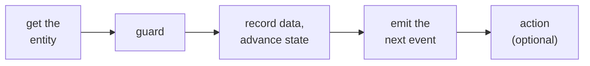

A handler is what a system node runs when a matching event arrives. You declare it as YAML, and
the engine runs its parts in a fixed order (not the order you write them) and commits them all
in one transaction, so a crash never leaves a half-applied change. The common path:

This page is the overview; each part below has its own page with the syntax and examples. For
the conceptual model see [System nodes and handlers](/concepts/system-nodes-and-handlers); for
the full step order and precedence see the [execution model](/reference/execution-model); for
the exhaustive field list see [Handler fields](/reference/handler-fields).

## How data moves between steps

Three places hold data, and each is reached a different way:

- **The entity** is the durable store. Write to it with `data_accumulation`; read it anywhere
  with `entity.*`. Entity fields persist across handlers, so a value written when the ticket was
  created is still readable when a later event arrives.
- **The emitted payload** is how a handler hands data to the next subscriber. You build it with
  `emit.fields`. It is neither the entity nor the triggering event: you populate it explicitly.
- **An agent sees only the payload of the event delivered to it**, never the entity directly. So
  that payload is the contract for what the agent can act on. If a resolver agent needs the
  ticket body, the event that reaches it must carry the body.

So a value flows like this: an event arrives, `data_accumulation` records what matters on the
entity, and `emit.fields` reads from the entity to populate the next event.

## What goes in a handler

A handler is written roughly in this order, and each part is its own page:

<CardGroup cols={2}>
  <Card title="Getting the entity" icon="inbox" href="/build/handlers/entity-acquisition">
    `create_entity`, `select_entity`, `select_or_create_entity`: how a handler gets the entity it
    acts on.
  </Card>
  <Card title="Guards" icon="shield-halved" href="/build/handlers/guards">
    `guard`, `check`, and `on_fail`: only proceed when a condition holds.
  </Card>
  <Card title="Writing data and advancing state" icon="database" href="/build/handlers/data-and-state">
    `data_accumulation`, `advances_to`, `sets_gate`, `clear_gates`.
  </Card>
  <Card title="Emitting events" icon="paper-plane" href="/build/handlers/emitting">
    `emit` and `emit.fields`: populate and send the next event.
  </Card>
  <Card title="Branching" icon="code-branch" href="/build/handlers/branching">
    `on_complete` and `rules`: take different paths.
  </Card>
  <Card title="Accumulation and computation" icon="layer-group" href="/build/handlers/accumulation">
    `accumulate`, `compute`, `filter`, `reduce`, `count`, `fan_out`, `query`.
  </Card>
  <Card title="Actions" icon="bolt" href="/build/handlers/actions">
    `create_flow_instance`, `record_evidence`, `mailbox_write`, `artifact_repo_commit`.
  </Card>
</CardGroup>
