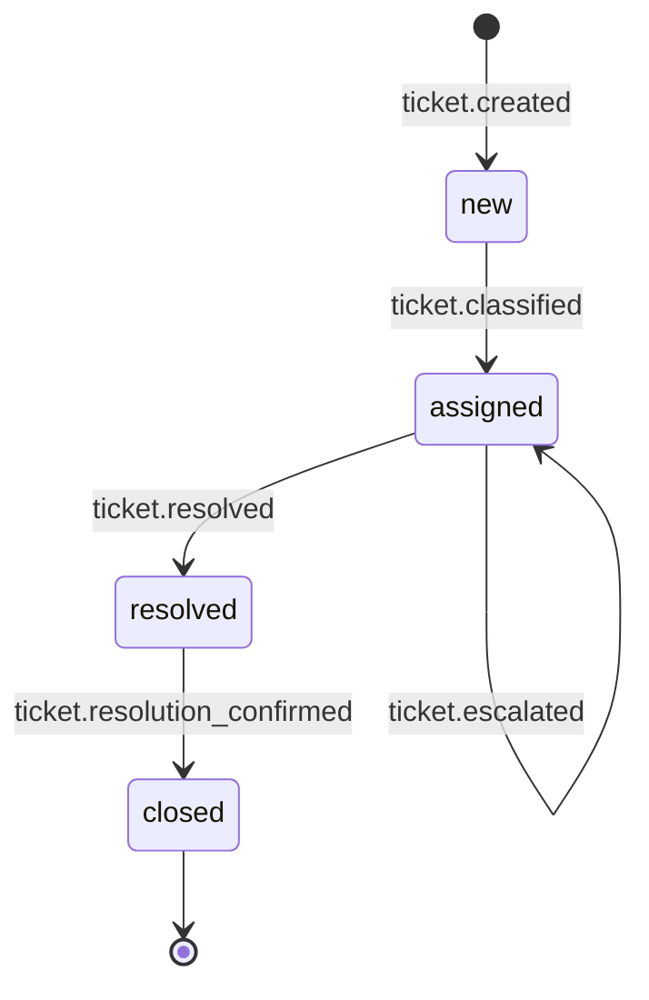

A flow's **state machine** is the lifecycle of the entity moving through it. The entity sits
in exactly one state at a time, and a handler moves it forward by setting `advances_to`.
`schema.yaml` declares that lifecycle, along with the flow's public **pins** and the **agent
roles** it needs.

The support-ticket flow has this lifecycle:



Each arrow is a handler's `advances_to`, and the label is the event that triggers it. The
self-arrow on `assigned` is the escalation retry loop.

## States

```yaml
initial_state: new
terminal_states: [closed]
states: [new, assigned, resolved, closed]
```

An entity is in exactly one state, set by a handler's `advances_to`. Terminal states are
absorbing, once reached, new events are rejected and timers are cancelled. A flow with
`initial_state: null` and `states: []` is stateless. See
[Gates, timers, and state](/concepts/gates-timers-and-state).

Every declared state must be reachable: it is either the `initial_state` or the target of
some `advances_to`. The analyzer flags states that nothing reaches (see
[Analyzer checks](/reference/analyzer-checks)).

## Pins

Pins are the flow's public interface. Event pins declare what it accepts and emits; data pins
declare what entity fields it reads and writes.

```yaml
pins:
  inputs:
    events: [ticket.created]
    reads: [priority]
  outputs:
    events: [ticket.resolved, ticket.abandoned]
    writes: [category, resolution]
```

No two flows may write the same data pin, that conflict is a boot error. Output event pins
are the activation switch for cross-flow routing; an emit of a pin-declared output must
resolve a target or set `broadcast: true`. Internal events not listed in pins are ordinary
event-loop emits and need no target.

## Required agents

`required_agents` declares the roles the flow needs. Fulfillment has two conditions, both
checked at boot:

```yaml
required_agents:
  - role: classifier-agent
    subscribes_to: [ticket.created]
    emits: [ticket.classified]
```

1. An agent in `agents.yaml` whose map key matches the `role` name.
2. That agent's subscriptions cover the required `subscribes_to`, and its `emit_events` cover
   the required `emits`.

## Acquiring an entity

A stateful flow's input-pin handler must say how it gets the entity to operate on. It
declares exactly one acquisition mode:

- `create_entity: true`: mint a new entity at `initial_state`.
- `select_entity`: resolve exactly one existing flow-owned entity by a declared business
  key.
- `select_or_create_entity`: resolve one existing, or deterministically mint one.

Omitting all three on a stateful input-pin handler is a boot error. See
[Composing flows](/build/composition) for cross-flow handoff patterns.
