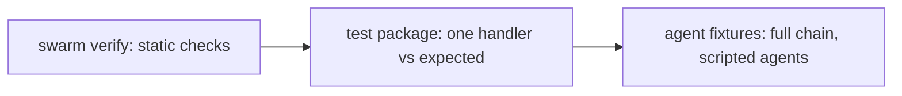

Swarm gives you three layers of testing, cheapest to most thorough: the static analyzer (no
runtime), test packages (one handler, deterministic), and agent fixtures (a full event chain
without spending tokens).



<Note>
  Of the three, **`swarm verify` is the layer you run directly today.** Test packages and agent
  fixtures are the format the platform's own conformance suite uses; they are exercised through
  the Go test harness (`go test ./internal/runtime/swarmflowtest`), not a CLI command. There is no
  `swarm test` yet. So read the two sections below as the *shape* your tests take, with the runner
  still developer-side.
</Note>

## The static analyzer

`swarm verify` validates a contract bundle against the platform specification, the one
command that runs purely on files, with no runtime needed.

```bash
swarm verify --contracts ./ticket-flow
```

The same checks run at boot. Findings have a severity: an `error` aborts (the bundle cannot
ship), a `warning` is logged but allows boot. Checks cover payload coverage, state
reachability, agent fulfillment, handler-field validity, entity write targets, CEL parsing,
single-node-per-event, and event cycles, among others. See
[Analyzer checks](/reference/analyzer-checks) for the catalog.

## Test packages

A test package is a minimal flow plus an `expected.yaml` that exercises one capability. It
declares a trigger and the expected outcome, so you can assert a handler's behavior
deterministically:

```yaml expected.yaml
trigger:
  event: ticket.classified
  payload:
    ticket_id: t-001
    category: billing
    priority: high
expected:
  handler_outcome: success
  entity_state: assigned
  emitted_events: [ticket.assigned]
  entity_fields:
    category: billing
    priority: high
```

`handler_outcome` is one of `success`, `reject`, `discard`, `kill`, `escalate`,
`dead_letter`, `terminal_reject`, `waiting`, or `fanned_out`.

## Agent fixtures

To test full event chains without spending tokens, run agents in a scripted mode and supply
fixture responses. The platform intercepts an agent's subscriptions and replays the fixture
events instead of calling the model, which is how the conformance suite validates behavior
against a scripted runtime rather than a live LLM.

## Before you deploy

<Check>Every `advances_to` target is a declared state.</Check>
<Check>Every emitted event has a payload schema, and emit sites supply all declared fields.</Check>
<Check>Every entity field a handler writes exists in `entities.yaml`.</Check>
<Check>Every condition is prefixed (`payload.`, `entity.`, `policy.`) and references real fields.</Check>
<Check>No two system nodes handle the same event.</Check>
<Check>`on_complete` is a list; it is not combined with `rules`.</Check>
<Check>Each stateful input-pin handler declares one entity-acquisition mode.</Check>
<Check>`swarm verify` returns no errors.</Check>
