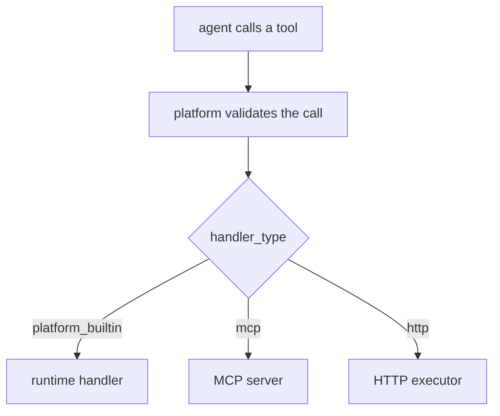

The platform owns all tool schema serving, validation, and routing. Every tool belongs to one
of three implementation classes. Whatever the class, the platform validates each call against
the tool's schema and routes it to the right executor:



## The three tool classes

```yaml tools.yaml
knowledge_base_search:
  description: Search the support knowledge base.
  handler_type: http
  input_schema:
    query: text
    max_results: integer
  http:
    method: POST
    url: "https://kb.internal/search"
```

| `handler_type` | Served by | Notes |
|---|---|---|
| `platform_builtin` | the runtime | A fixed set shipped with the platform. |
| `mcp` | an MCP server | Registered in `policy.yaml`; namespaced by prefix. |
| `http` | the HTTP executor | Needs an `http` block (`method`, `url`); the default class. |

A custom tool requires a `description`. Optional fields are `handler_type` (defaults to
`http`), `input_schema`, `output_schema` (and the aliases `parameters`/`returns`), and, for
HTTP tools, `http`, `response_mapping`, `credentials`. The fields `endpoint` and `type` are
**not** accepted (use `http.url` and `handler_type`).

<Note>
  `workflow_registered` and `api_call` are deprecated handler types. They still load
  (`workflow_registered` is normalized to `http` when an `http` block is present), but new
  tools should use `handler_type: http` or an MCP server.
</Note>

## MCP tools

Swarm acts as an MCP client. Register servers in `policy.yaml`:

```yaml policy.yaml
mcp_servers:
  postgres:
    transport: http
    url: "https://mcp.internal/pg"
    prefix: pg
    credentials_key: pg_token
```

Tools are namespaced by the server's `prefix` (`pg.list_tables`), and an agent references the
prefixed name in its `tools` list. An unreachable server logs a warning at boot and does not
abort the boot. See the [MCP gateway reference](/reference/mcp-gateway).

## Native capabilities

`bash`, `web_search`, and `file_io` are not declared in `tools.yaml`; they are host
capabilities gated by an agent's `native_tools` field (default all off):

```yaml
native_tools:
  bash: true
  web_search: false
  file_io: true
```

The field is the authorization gate, and it is a **separate channel** from both `tools` and
`permissions`. Permissions govern platform operations (shared state, routing, mailbox); native
tools govern local execution (host shell, web, filesystem). If `native_tools.bash` is `true`, the
agent gets `bash`, with no matching permission entry required.

On the shipped Claude CLI runtime these three are **provider-native**: the platform will not
inject a fallback to satisfy them, so a capability the runtime cannot provide **fails closed**
rather than being silently downgraded. In particular, setting `policy.web_search_provider` does
**not** satisfy `native_tools.web_search` on the CLI runtime; the capability still has to be
provider-native.

## Flow reference data

A flow-scoped agent can read immutable deploy-time files shipped under its flow package's
`data/` directory by declaring `flow_data_access`:

```yaml
flow_data_access:
  - exclusions.yaml
  - templates/review.md
```

That generates a `read_flow_data` tool for the agent, restricted to exactly the declared
filenames. This is static contract data (templates, lookup tables), not entity state, not
mutable, and not native file I/O; it ships and versions with the contract bundle. The
authorization is `flow_data_access` itself, so it needs no `permissions` entry and is not granted
through `tools`. Root or project-scoped agents cannot declare it.

## Default-deny

An agent can only call a tool that is in its `tools` list, a universal tool, an emit tool, a
generated entity tool, a `read_flow_data` tool (if it declares `flow_data_access`), or an enabled
native capability. Anything else is rejected.
