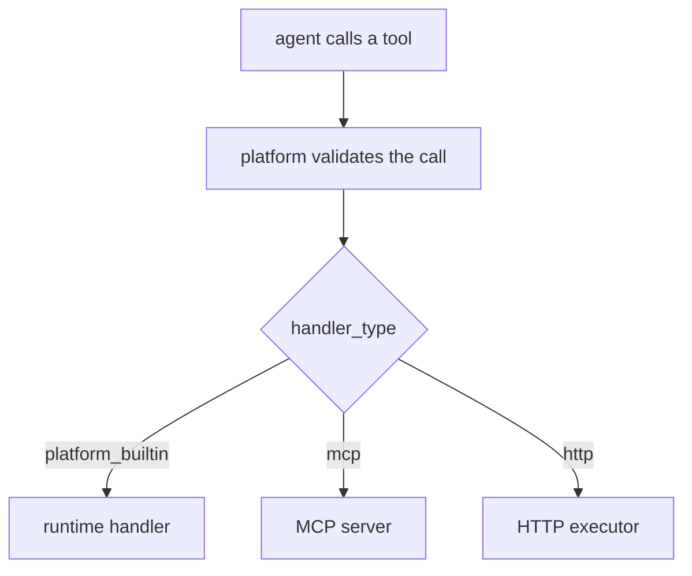

The platform owns all tool schema serving, validation, and routing. Every tool belongs to one
of three implementation classes. Whatever the class, the platform validates each call against
the tool's schema and routes it to the right executor:



## The three tool classes

```yaml tools.yaml
knowledge_base_search:
  description: Search the support knowledge base.
  handler_type: http
  input_schema:
    query: text
    max_results: integer
  http:
    method: POST
    url: "https://kb.internal/search"
```

| `handler_type` | Served by | Notes |
|---|---|---|
| `platform_builtin` | the runtime | A fixed set shipped with the platform. |
| `mcp` | an MCP server | Registered in `policy.yaml`; namespaced by prefix. |
| `http` | the HTTP executor | Needs an `http` block (`method`, `url`); the default class. |

A custom tool requires a `description`. Optional fields are `handler_type` (defaults to
`http`), `input_schema`, `output_schema` (and the aliases `parameters`/`returns`), and, for
HTTP tools, `http`, `response_mapping`, `credentials`. The fields `endpoint` and `type` are
**not** accepted (use `http.url` and `handler_type`).

<Note>
  `workflow_registered` and `api_call` are deprecated handler types. They still load
  (`workflow_registered` is normalized to `http` when an `http` block is present), but new
  tools should use `handler_type: http` or an MCP server.
</Note>

## MCP tools

Swarm acts as an MCP client. Register servers in `policy.yaml`:

```yaml policy.yaml
mcp_servers:
  postgres:
    transport: http
    url: "https://mcp.internal/pg"
    prefix: pg
    credentials_key: pg_token
```

Tools are namespaced by the server's `prefix` (`pg.list_tables`), and an agent references the
prefixed name in its `tools` list. An unreachable server logs a warning at boot and does not
abort the boot. See the [MCP gateway reference](/reference/mcp-gateway).

## Native capabilities

`bash`, `web_search`, and `file_io` are not declared in `tools.yaml`; they are host
capabilities gated by an agent's `native_tools` field (default all off):

```yaml
native_tools:
  bash: true
  web_search: false
  file_io: true
```

`native_tools` is its own switch, separate from both `tools` and `permissions`. They cover
different things: `permissions` are about what an agent may do to shared platform state (routing,
the mailbox, entity writes), while `native_tools` are about what it may do on the host machine
(run a shell command, search the web, read or write files). So you do not also add a permission
for `bash` anywhere; turning on `native_tools.bash` is the whole grant.

One thing to know on the Claude CLI runtime: there, `bash`, `web_search`, and `file_io` come from
the CLI itself, and the platform will not stand in a substitute. If you turn one on and the
runtime cannot provide it, you get a clear error at startup rather than an agent that quietly
runs without it. (Setting `policy.web_search_provider` does not count as providing `web_search`
here; it has to come from the CLI.)

## Flow reference data

Sometimes an agent needs to read a fixed file you ship with the flow: a prompt template, a
lookup table, a list of things to skip. Put the file under the flow package's `data/` directory
and list it in the agent's `flow_data_access`:

```yaml
flow_data_access:
  - exclusions.yaml
  - templates/review.md
```

The agent then gets a `read_flow_data` tool that can open exactly those files and nothing else.
These files are read-only and travel with your contracts, so they change when you redeploy, not
while the flow is running. That makes them right for reference data, not for entity state or
scratch files the agent writes. As with `native_tools`, listing the file is the whole grant: no
`permissions` entry, and it is not part of `tools`. Only flow-scoped agents can use it.

## Default-deny

An agent can only call a tool that is in its `tools` list, a universal tool, an emit tool, a
generated entity tool, a `read_flow_data` tool (if it declares `flow_data_access`), or an enabled
native capability. Anything else is rejected.
