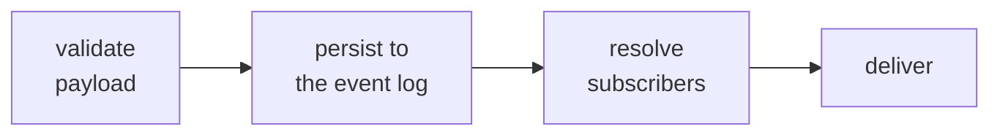

Events are the only way work moves through Swarm. There is no shared memory and no direct calls
between actors: a system node or an agent emits a typed event, the platform persists and routes
it, whoever subscribed handles it, and the events they emit carry the work forward. Get this one
idea and the rest of the runtime follows from it.

## What an event is

Every event has a name and a typed payload, declared in `events.yaml`:

```yaml events.yaml
ticket.created:
  ticket_id: text
  subject: text
  body: text
```

Whoever emits an event must fill **every** field its payload declares. Nothing is copied
automatically from the triggering event, and there are no defaults; we call this
**producer-complete**. An event also carries runtime-stamped context, such as its source and the
run it belongs to, which you read through `event.*` rather than `payload.*`. You never author
that part.

## The lifecycle of an event

Every event goes through the same four steps:



<Steps>
  <Step title="Validate">
    The payload is checked against its `events.yaml` schema. An invalid event is logged and
    discarded, never delivered.
  </Step>
  <Step title="Persist">
    The event is written to the log before any processing.
  </Step>
  <Step title="Resolve subscribers">
    The platform finds the system nodes and agents that subscribe to the event.
  </Step>
  <Step title="Deliver">
    Each subscribing node runs its handler; each subscribing agent receives the event in its
    inbox.
  </Step>
</Steps>

The order is the point: an event is **persisted before it is delivered**. If the runtime crashes
after persisting, the event replays on recovery and nothing is lost.

## Routing is derived, not chosen

Here is what makes runs reproducible: no LLM decides who acts next. Who receives an event follows
entirely from who declared a **subscription** to it.

- A system node subscribes in `nodes.yaml` (`subscribes_to`, plus an `event_handlers` entry).
- An agent subscribes in `agents.yaml` (`subscriptions`).

`events.yaml` defines payload *shapes*, never routing. So you change who receives an event by
editing a subscription, never by touching its payload, and there is no router in the loop that
could send it somewhere unexpected.

## Nodes own, agents observe

Who subscribes also decides what the delivery *means*:

| Subscribers | What happens |
|---|---|
| A system node (alone, or alongside agents) | The node owns the event and the state transition. If agents subscribe too, both receive it (**dual delivery**). |
| Only agents | The agents receive it and may reason and emit, but no state changes. |
| No one | The event is persisted and goes nowhere. |

A single event is owned by **at most one** system node (two is a boot error), which keeps state
authority unambiguous. Agents are not limited this way: many can observe the same event, because
they only react and never own state.

## A worked example

Say a ticket flow has a node and an agent that both care about `ticket.created`:

```yaml nodes.yaml
ticket-orchestrator:
  subscribes_to: [ticket.created]
  event_handlers:
    ticket.created:
      create_entity: true
      advances_to: triaging
      emit: ticket.triaged
```

```yaml agents.yaml
classifier-agent:
  subscriptions: [ticket.created]
  emit_events: [ticket.classified]
```

Nothing here declares routing; it is inferred from the two subscriptions. When `ticket.created`
fires:

1. It is validated and persisted.
2. Subscribers resolve to the node and the agent, so this is **dual delivery**.
3. The node advances the ticket to `triaging` and emits `ticket.triaged`, in one transaction.
   The agent independently reasons and later emits `ticket.classified`.
4. `ticket.triaged` and `ticket.classified` each enter the loop as new events and route to their
   own subscribers.

To send `ticket.created` somewhere else, you change a `subscribes_to` or `subscriptions` list.
The payload does not move.

## Crossing flow boundaries

Inside one flow, routing is just subscription matching, and that is most of what you write. To
send an event to **another flow**, or to a **specific instance**, a flow uses its pins and an
explicit target (and wildcard subscriptions pick up dynamic instances that did not exist at
boot). That is its own topic, with its own rules about how a recipient is resolved.

<CardGroup cols={2}>
  <Card title="Composing flows" icon="puzzle-piece" href="/build/composition">
    Pins, targets, the parent route, and wildcard subscriptions for cross-flow routing.
  </Card>
  <Card title="System nodes and handlers" icon="gears" href="/concepts/system-nodes-and-handlers">
    What a node does with an event once it is delivered.
  </Card>
</CardGroup>
