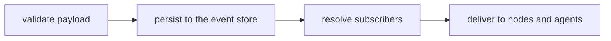

Events are the only way work moves through Swarm. This page builds up from the simple case
(events inside one flow) to the part that looks complex at first: routing events across
flows, including dynamic instances.

## Events as the only communication primitive

An agent or system node emits an event, the platform validates and persists it, subscribers
handle it, and the events they emit continue the chain. Nothing else carries work, there is
no shared memory and no direct function calls between actors.

Every event has a typed payload schema in `events.yaml`. Whoever emits an event must populate
every field it declares, through `emit.fields` or an agent's emit tool; there are no payload
defaults and no passthrough from the triggering event. We call this **producer-complete**.

## The event lifecycle

Each event goes through the same fixed cycle. Understanding it explains most routing
questions.



<Steps>
  <Step title="Validate">
    The payload is checked against its `events.yaml` schema. An invalid event is logged and
    discarded, never delivered.
  </Step>
  <Step title="Persist">
    The event is written to the event store before any processing. If the runtime crashes
    after this point, the event replays on recovery.
  </Step>
  <Step title="Resolve subscribers">
    The platform finds the system nodes and agents subscribed to the event. If the event
    carries a target (see below), the recipient set is narrowed first.
  </Step>
  <Step title="Deliver">
    Each subscribing node runs its handler atomically; each subscribing agent gets the event
    in its inbox asynchronously. Events emitted by a node handler are persisted inside its
    transaction and delivered only after it commits.
  </Step>
</Steps>

## Routing is derived, not chosen

`events.yaml` defines payload *shapes*, not routing. Routing comes entirely from declared
subscriptions:

- `nodes.yaml`: a node's `subscribes_to` list and its `event_handlers`.
- `agents.yaml`: an agent's `subscriptions` and `emit_events`.

Who receives an event follows from who subscribes:

| Subscribers | Delivery |
|---|---|
| A system node (and maybe agents) | The node **owns** the event and the transition. With agents too, it is **dual delivery**: both receive it. |
| Only a system node | **Node-only** delivery. |
| Only agents | **Pure agent** delivery (passthrough); no state transition. |
| No one | The event is persisted but goes nowhere. |

A single event is owned by **at most one system node** (two nodes handling the same event is
a boot error), which keeps state authority unambiguous. Agents are not constrained this way.
You change who receives an event by editing subscriptions, never by touching its payload
schema, and no LLM ever decides routing.

## A worked example

Say a ticket flow declares one event, a system node, and an agent that all touch
`ticket.created`:

```yaml events.yaml
ticket.created:
  ticket_id: text
  subject: text
```

```yaml nodes.yaml
ticket-router:
  id: ticket-router
  execution_type: system_node
  subscribes_to: [ticket.created]
  event_handlers:
    ticket.created:
      advances_to: triaging
      emit: ticket.triaged       # internal event, no target needed
```

```yaml agents.yaml
classifier-agent:
  id: classifier-agent
  role: classifier-agent
  subscriptions: [ticket.created]
  emit_events: [ticket.classified]
```

Nothing here declares routing; it is inferred from the two subscriptions. When
`ticket.created` fires:

1. The payload is validated against `events.yaml` and persisted.
2. Subscribers resolve to `ticket-router` (a node) and `classifier-agent` (an agent), so this
   is **dual delivery**.
3. The node runs its handler in one transaction: it advances the ticket to `triaging` and
   emits `ticket.triaged`. The agent independently receives `ticket.created` in its inbox,
   reasons, and later emits `ticket.classified`.
4. `ticket.triaged` and `ticket.classified` each enter the loop as new events and route to
   their own subscribers.

To send `ticket.created` somewhere else, you change a `subscribes_to` or `subscriptions`
list. The event's payload schema does not move.

## Addressing

References resolve by whether they contain a slash:

- **Local**, no slash: `order.created` means the event of that name in the current flow.
- **Absolute**, with slashes: `review/analysis/analysis.completed` is navigated from the
  root flow down.

Authors almost always write local names. Internally the platform stores and routes by
flow-qualified names and localizes them again for handler lookup, so two flows can both have
an `orchestrator` node or a `completed` event with no collision.

## Subscription wildcards

A subscription can match across flows with wildcards:

- `*` matches **one** path segment, that is, any direct child flow at that level.
- `**` matches **any depth** below that point.

```yaml
# in an agent's subscriptions
subscriptions:
  - fulfillment/*/order.completed     # any direct fulfillment instance
  - "**/error.raised"                 # any flow at any depth
```

Wildcards exist mainly for **dynamic instances**: you cannot name an instance that does not
exist yet, so a wildcard subscription matches new instances automatically as they are
created. (`*` matches template instances, not static flow names and not agent shards.)

## The event envelope

An event has two layers. The **payload** is the business data you declare in `events.yaml`.
The **envelope** is runtime-owned context that you never author; consumers read it through
`event.*`, not `payload.*`.

The platform stamps envelope fields such as `source_event_id`, `run_id`, `trigger_event_type`,
and `emitted_at`. Three envelope fields carry routing identity:

| Field | Meaning |
|---|---|
| `event.source` | The emitter's route identity (its `flow_instance` and `entity_id`). Always set, and never overwritten, so lineage survives replay and retries. |
| `event.target` | A single resolved recipient. |
| `event.target_set` | A concrete list of recipients, for explicit fan-out. |

`event.target` and `event.target_set` are never both set. For an ordinary event inside a flow,
neither is set, delivery is by subscription, and you can ignore targets entirely.

## Cross-flow routing and targets

Targets matter when an event crosses a flow boundary through a **pin**. This is the part that
looks complex; the rules are designed so an event can never silently fan out to the wrong
recipients.

**Activation.** Pin routing turns on only when the emitted event is declared in the emitter
flow's `pins.outputs.events`. An event that is not a declared output pin is an ordinary
event-loop emit and needs no target. At boot the platform auto-wires output pins to the input
pins that accept them; if one input pin could match outputs from more than one flow, boot
fails until you disambiguate.

**A pin-declared output emit must resolve a recipient.** It does so through one of these, in
priority order:

1. An explicit `target` on the emit.
2. A structural parent route (a child flow emitting back to its parent).
3. Receiver-side `select_entity` / `select_or_create_entity` late binding.
4. An explicit `broadcast: true` opt-out.

If none of these applies, boot or publish fails closed. There is no silent fallback to
broadcasting by event type.

### Target forms

```yaml
emit:
  event: order.fulfilled
  target: sender            # reply to whoever sent the triggering event
```

| `target` | Resolves to |
|---|---|
| `sender` | The immediate sender of the triggering event (its `event.source`). In a chain A to B to C, C's `sender` is B, not A. |
| `{ instance_id }` | A specific child or template instance. |
| `{ flow, match }` | Exactly one instance whose entity fields match. Zero or more than one match fails closed. |
| `{ flow, match, allow_fanout: true }` | One or more instances. Materializes `event.target_set` and delivers one copy per recipient. |
| `broadcast: true` | A deliberate opt-out: no target is set, delivery falls back to subscribers. |

### Parent and child instances

A dynamic instance records a **parent route** when it is created, so a child flow's
pin-declared output can return to its parent without naming it. A child has exactly one parent
in v1, and parent-to-child routing is never inferred structurally: a parent reaching a
specific child uses `target: { instance_id }`.

## Reserved metadata

Event-level metadata lives under the reserved `swarm:` namespace in `events.yaml`:

- `swarm.source`: proof that an external system or the platform produced the event.
- `swarm.consumer`: proof of an external sink.
- `swarm.status`: a lifecycle marker, such as `planned`.
- `swarm.producer`: an exceptional non-derivable producer, such as `mailbox_human`.

The `platform.` prefix is reserved for the engine's own events (for example
`platform.dead_letter`); products may subscribe to them but must not define events under that
prefix.
