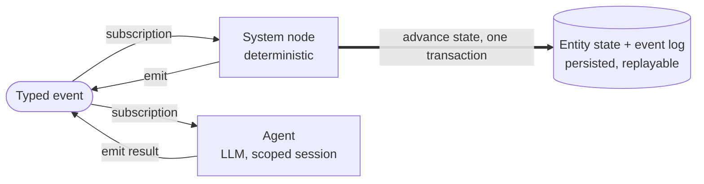
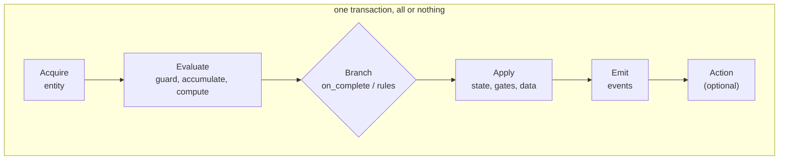

This section explains what Swarm is, independent of how you author any one contract. Read it
once to build the mental model; the [Build a flow](/build/flow-package) and
[Reference](/reference/contracts/overview) sections show the exact syntax.

## Two kinds of actor, and only one owns the truth

Every actor you declare is one of two kinds, and the split is the whole idea:

- A **system node** is deterministic code, no prompt and no model. It owns state: it advances
  the entity, sets gates, writes fields, and emits events.
- An **agent** is an LLM session. It reasons inside a scoped session, calls tools, and emits
  events carrying its results. It never writes state directly.

Both communicate the same way, by emitting typed events. What differs is what each is trusted
with. An agent can *propose* an outcome by emitting an event; a system node decides what that
event actually changes. So an agent can never leave the entity in a state it only *claimed* to
reach, the way it could if it were also the bookkeeper.

Reading it: an event routes to its subscribers by their declared subscriptions, never by an
LLM. A subscribing system node runs its handler and commits the state change in one
transaction; a subscribing agent reasons and emits its own event. Notice that only the system
node touches state. Both kinds of emitted event re-enter the loop and route to their own
subscribers.

A third actor is implicit: the **runtime** itself handles transitions you never declare, such
as a human decision arriving through the mailbox or a flow's own lifecycle. You never write it
in a contract.

## The nouns to keep separate

| Concept | One line |
|---|---|
| **Flow** | A self-contained package of contracts with typed input/output pins. The composition unit. |
| **Flow instance** | One running copy of a flow. A flow is the class; the instance is the object. |
| **Entity** | A mutable document moving through a flow instance's state machine: state, gates, and fields. |
| **State** | A named state in a flow's state machine. An entity is in exactly one at a time. |
| **System node** | Deterministic code. Subscribes to events, advances state, emits events. No LLM. |
| **Agent** | An LLM session. Subscribes to events, reasons, calls tools, emits events. |
| **Handler** | The unit of execution attached to an event on a system node. |
| **Event** | A typed message with a payload schema, declared in `events.yaml`. |
| **Gate** | A named boolean on an entity, set by a handler and checked by guards. |
| **Timer** | A durable time-based trigger attached to a stage. |
| **Pin** | A typed input or output of a flow, used to wire flows together. |

## The runtime in six sentences

1. A flow declares its states, pins, and required roles.
2. System nodes subscribe to events and own deterministic transitions.
3. Agents subscribe to events and handle reasoning work.
4. Events move work through the system: they are the only communication mechanism.
5. Each handler execution commits atomically.
6. The platform persists state, events, deliveries, sessions, timers, runs, and mutations in
   platform-owned tables.

## How a transition executes

When an event reaches a system node, its handler runs through a fixed dependency graph, not
the order you wrote the fields in, and commits in one transaction. Grouped into stages:

No LLM decides what fires next. Routing is derived from declared subscriptions, and every
step commits together, so a crash mid-handler leaves no partial state. For the exact stage
order and the short-circuits that stop a handler early, see
[System nodes and handlers](/concepts/system-nodes-and-handlers).

<CardGroup cols={2}>
  <Card title="Flows and entities" icon="diagram-project" href="/concepts/flows-and-entities" />
  <Card title="System nodes and handlers" icon="gears" href="/concepts/system-nodes-and-handlers" />
  <Card title="Agents and sessions" icon="robot" href="/concepts/agents-and-sessions" />
  <Card title="Events and routing" icon="bolt" href="/concepts/events-and-routing" />
  <Card title="Persistence, replay, and fork" icon="clock-rotate-left" href="/concepts/persistence-replay-and-fork" />
  <Card title="Human in the loop" icon="user-check" href="/concepts/human-in-the-loop" />
</CardGroup>
