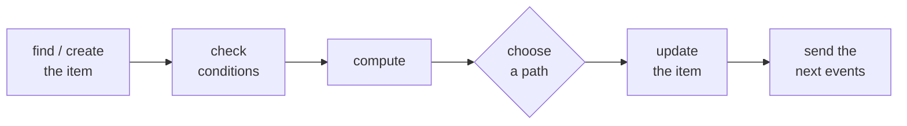

Every Swarm workflow has two kinds of worker: **agents**, which are LLMs that make judgment
calls, and **system nodes**, which handle everything that has to be exact and repeatable. A
system node is plain workflow logic you write as YAML, with no model and no prompt. Its job is
to own the things you would never want an LLM to track on its own: what state each item is in,
what data has been recorded, and which step happens next.

The division of labor is the whole point. An agent proposes an outcome by sending an event; a
system node decides what that event actually changes. So a ticket only reaches `resolved`
because a system node moved it there, never because an agent said it was done.

## What a system node does

A system node listens for events. For each kind of event, it runs a **handler**: a small set of
instructions for what to do when that event arrives. If you have written an event handler or a
route in a web app, this is the same idea, one per event type, except you write it as
configuration instead of code, and Swarm runs it the same way every time (the same input always
produces the same result).

**Exactly one node owns each event.** Two nodes handling the same event is an error caught
before the system starts. That single owner is what makes a change unambiguous: there is never a
question of which node moved the ticket to `assigned`. Agents work differently, because they
only react to events and never change state directly, so any number of them can listen to the
same event.

## A handler, in plain English

A handler answers one question: when this event arrives, what changes? Here is one that runs
when a ticket has been classified:

```yaml
ticket.classified:
  guard:                              # only continue if the category is one we handle
    id: valid_category
    check: "payload.category in ['billing', 'technical', 'account']"
    on_fail: reject
  data_accumulation:                  # record category and priority on the ticket
    writes: [category, priority]
    source_event: ticket.classified
  advances_to: assigned               # move the ticket to the "assigned" state
  emit: ticket.assigned               # send the next event, for whoever handles assigned tickets
```

Read as a sentence: *if* the category is valid, save `category` and `priority` onto the ticket,
move it to `assigned`, and send a `ticket.assigned` event. The agent that classified the ticket
never touched the ticket's state to make any of this happen.

Every handler has that same shape: an event comes in, the handler looks at the item it concerns
(here, the ticket), changes that item, and sends the next event. That is the whole job.

## You declare what; the engine decides when

You can write a handler's steps in any order. Swarm ignores the order you wrote them and always
runs them in the same fixed sequence: find or create the item, check the conditions, do any
computation, choose a path, save the changes, and send the next events.



So the order of lines in your YAML does not matter; the order things happen in is fixed. Most
handlers use only a few of these steps. For the complete sequence and the rules about what takes
precedence, see the [handler execution model](/reference/execution-model).

## It all saves together

Everything a handler does, the state change, the data it records, and the events it sends, is
saved in one database transaction: all of it, or none of it. If the process crashes halfway
through, nothing is left half-finished; the event simply runs again when the system restarts.

This is what lets the rest of the flow trust an item's state. A ticket is always in exactly one
of the states you declared, never stuck somewhere in between, and never showing a result that
was not actually committed.

## Branching

A handler can also take different paths, based on the incoming event or on something it worked
out along the way. Swarm has two ways to do that, `rules` and `on_complete`. See
[Writing handlers](/build/handlers) for how to use them.

<CardGroup cols={2}>
  <Card title="Writing handlers" icon="gears" href="/build/handlers">
    Guards, branching, recording data, and filling event payloads, with worked examples.
  </Card>
  <Card title="Handler execution model" icon="diagram-project" href="/reference/execution-model">
    The full step order, how it all commits, and the precedence rules.
  </Card>
  <Card title="Handler fields" icon="list-tree" href="/reference/handler-fields">
    Every field a handler can declare, with its schema and constraints.
  </Card>
  <Card title="Events and routing" icon="bolt" href="/concepts/events-and-routing">
    How an event you send finds its next handler.
  </Card>
</CardGroup>
