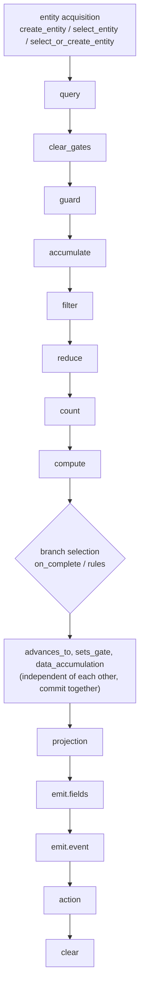

## System nodes

System nodes are deterministic orchestrators. They subscribe to events and execute handler
declarations, no code, just YAML. A system node has no prompt and no model; it owns the
workflow's state transitions.

**One system node per event.** No two nodes may handle the same event, which gives every
event an unambiguous state authority. Agents are not constrained this way, many agents may
subscribe to the same event.

## Handlers

A handler is the unit of execution attached to an event. It declares what happens when that
event arrives, guards, state changes, data writes, emitted events, and actions:

```yaml
ticket.classified:
  guard:
    id: valid_category
    check: "payload.category in ['billing', 'technical', 'account']"
    on_fail: reject
  data_accumulation:
    writes: [category, priority]
    source_event: ticket.classified
  advances_to: assigned
  emit: ticket.assigned
```

## The dependency graph

A handler's fields execute in a fixed causal order, a dependency graph, not a script. YAML
field order is cosmetic:



Two short-circuits stop a handler early:

- **Guard failure** runs the configured `on_fail` action (`reject`, `discard`, `kill`, or
  `escalate:{event}`).
- **Accumulate incomplete** records the arrival and waits (observable outcome `waiting`).

## Atomicity

Every handler execution is atomic. State changes, gate updates, data writes, and event
persistence commit in a single database transaction, no observer sees intermediate state,
and a crash mid-handler rolls back cleanly. Because `advances_to`, `sets_gate`, and
`data_accumulation` commit together, their relative order is cosmetic.

Guards evaluate against entity state *before* any of the handler's writes. A handler's own
`data_accumulation` affects the *next* handler, not its own guard.

## Two ways to branch

`on_complete` and `rules` are mutually exclusive:

- **`on_complete`**: an ordered list of `{condition, advances_to, emit}`; the first matching
  condition wins. Used after accumulation or computation.
- **`rules`**: a map of named rules matched against the payload. Used for type-dispatch
  routing.

When a handler has `rules`, the matched rule owns the emit; a handler-level `emit` alongside
`rules` is rejected at boot as ambiguous.

See [Writing handlers](/build/handlers) for patterns and the full field
[reference](/reference/handler-fields).
