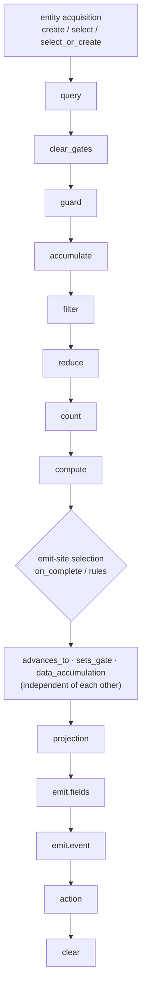

A handler's fields do not run in the order you write them. The engine runs them in a fixed
**dependency graph** and commits the whole thing in one transaction. That order, and the way
some fields override others, are not visible in the YAML you write. This page is the precise
model.

## The dependency graph

`advances_to`, `sets_gate`, and `data_accumulation` have no causal order among themselves, so
the engine may run them in any order; everything else follows the arrows.

## YAML order is cosmetic

The order you write fields in has no effect. A handler that lists `on_complete` before
`accumulate` still runs `accumulate` first. Re-arranging fields to "fix" behavior does nothing;
change the fields themselves.

## One handler, one transaction

Every side effect of a single handler execution, the state advance, gate writes, data writes,
and event persistence, commits in **one database transaction**. No observer sees a partial
handler, and a crash mid-handler rolls the whole thing back. Because the writes commit
together, their relative order is irrelevant.

## What overrides what

These rules interact, so read them as a unit:

- **Guards see pre-handler state.** A guard evaluates entity state as it stood *before* this
  handler's writes. A `data_accumulation` write in the same handler does not affect that
  handler's own guard; it affects the *next* handler's guard, after this transaction commits.
- **A branch or rule selects the emit site and can override the handler-level fields.**
  Handler-level `advances_to`, `sets_gate`, and `data_accumulation` are defaults. When an
  `on_complete` branch or a matched `rule` specifies one of them, the branch value **overrides**
  the handler-level value for that field only.
- **`rules` and handler-level fields combine, except emit.** With `rules`, the matched rule
  runs first and owns the emit. Handler-level `data_accumulation` then runs *and supplements*
  the rule's writes in the same transaction. But a handler-level `emit` alongside `rules` is
  ambiguous and **fails at boot**: payload ownership must live on the active emit site.
- **`advances_to` is skipped if `on_complete` already advanced.** A branch that advances the
  state wins; the handler-level `advances_to` does not also fire.
- **Projection runs after the branch writes and before `emit.fields`.** A `materialize_from`
  field is written after the selected branch's `data_accumulation`, so an `emit.fields`
  expression in the same handler observes the projected value. See
  [Accumulation and projection](/reference/accumulation).

## When a handler stops early

- **Guard fails.** The handler stops and runs the guard's `on_fail` action: `reject` (default,
  marks the event rejected), `discard` (drop silently), `kill` (advance the entity to a
  terminal state), or `escalate:{event}` (emit an escalation instead). No state advance, no
  emit, no data writes. Guard failures are business logic, not transient, so they are **not
  retried**.
- **Accumulation is incomplete.** The handler records the arrival and stops; the remaining
  steps run only when the completion condition is later met.

## Failures, retries, and dead letters

A handler that throws rolls back its atomic boundary. Transient errors are retried (bounded,
with backoff); guard failures, validation errors, and business-logic failures are not retried
and go to a dead letter.

**Chain-depth overflow behaves unusually.** If an emit would push the event chain past the
limit (default 50), the platform intercepts that downstream event before it enters the loop and
writes a `dead_letters` row for it, **but the handler that emitted it still reports success and
its other side effects (state, gates, data) still commit**. So a handler can succeed while the
event it meant to emit never fires. If a downstream step silently never happens, check the dead
letters for `chain_depth_exceeded`.

## Agents are not part of the handler transaction

Everything above is the system-node handler model. An **agent's** emit is a standalone event
publication: the platform validates its payload against `events.yaml` (missing required fields
fail the emit; undeclared fields fail rather than being stripped) and publishes it, but it is
**not** inside any node handler's atomic boundary. Treat an agent emit as its own unit of work,
not as part of a surrounding transaction.

<CardGroup cols={2}>
  <Card title="Handler fields" icon="list-tree" href="/reference/handler-fields">
    Every field a handler can declare, with its schema and constraints.
  </Card>
  <Card title="Accumulation and projection" icon="layer-group" href="/reference/accumulation">
    Waiting for many events, and copying them to a typed entity field.
  </Card>
</CardGroup>
